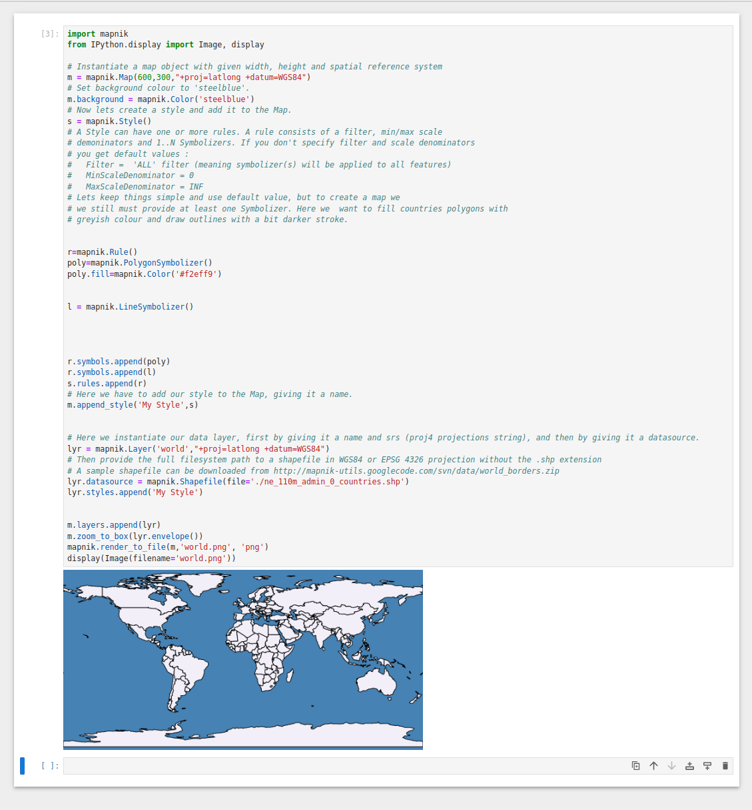

# JupyterMapnik
JupyterMapnik
Maps in Jupyter Notebook
Pamela Hauff

Researcher at b10human.blogspot.com
5 articles
July 10, 2023





## Installation in Ubuntu 22.04
Mapnik the core of geospatial visualization & processing is an SDK interface that links to different kinds of map data.
Mapnik dependencies
Mapnik-3.1 rely's upon boost-1.73 and python2.7.
## Install dependencies
### Python 2.7
Install python2.7 and link to 'python'. You may want to change this back to python3.8 afterwards.
```
sudo apt install python2.7 python2-dev
ln -s /usr/bin/python2.7 /usr/bin/python
```
### Boost
Warning boost versions other than 1.73 will produce errors when building mapnik-3.1.
Firstly we must download boost-1.73.

Make sure you have gcc installed.
```
sudo apt-get install gcc build-essential g++ python2-dev \
         autotools-dev libicu-dev libbz2-dev libboost-all-dev
```
Change to the boost directory.
```
cd boost_1_73_0
```
Edit the project-config.jam file and add "using python : 2.7 ;".
sudo nano project-config.jam
CTRL 'O' save and CTRL 'X' exit
Then following commands will build and install boost.
```
sudo ./bootstrap.sh --prefix=/usr/local/ 
./b2 
sudo ./b2 install
```
## Mapnik
Download mapnik-3.0.24 source tarball and unpack into your working directory.

### Install dependancies
```
sudo apt install libicu-dev \
    libxml2 libxml2-dev \
    libfreetype6 libfreetype6-dev \
    libharfbuzz-dev \
    libjpeg-dev \
    libpng-dev \
    libproj-dev \
    libtiff-dev \
    libcairo2-dev \
    libcairomm-1.0-dev \
    git build-essential \
    libgdal-dev
```
and
```
sudo apt install  postgresql postgresql-contrib \
    postgresql-postgis libsqlite3-dev
```
and
```
sudo apt-get install curl zlib1g-dev automake \
                     libtool xutils-dev make cmake pkg-config \
                     libcurl4-openssl-dev libpng-dev
```
and
```
sudo apt-get install libmapbox-variant-dev sqlite3 postgis
```
install pip for python2.7
```
curl https://bootstrap.pypa.io/pip/2.7/get-pip.py --output get-pip.py
sudo python2 get-pip.py
```

### PROJ.4
Download https://github.com/OrdnanceSurvey/proj.4
For Cartographic Projections.
```
cd proj.4-master
mkdir build
cd build
cmake ..
cmake . build
sudo cmake . build --target install
```

### Compiling Mapnik
mapnik uses stdc++ version 11 not 14 in this instance.
Proj4 should be install to use projections srs other than +proj=latlon 
If  you install Proj4 or larger make sure the proj-data is installed.

It may take some time to compile mapnik so time to make a coffee or tea and some biscuits.
```
export LD_LIBRARY_PATH=/lib:/usr/lib:/usr/local/lib
cd mapnik-3.0.24
PYTHON=python2.7 ./configure prefix=/usr/local/
make PYTHON=python2.7
sudo make PYTHON=python2.7 install
```
## Setup Python Mapnik
Download the v3.0.x version of python mapnik. The master version contains changes with boost libraries.

Unzip and enter python-mapnik-3.0.x directory:
```
cd python-mapnik-3.0.x/
sudo nano setup.py
```
change line 41 in setup.py
    suffixes.insert(0, "-py%d%d"%(sys.version_info.major,sys.version_info.minor))
Remove the '-py' from the above string.
CRTL 'o' , ENTER, CRTL 'x' to save file and exit from nano.

```
sudo python2.7 setup.py install
```
Install jupyter notebook
```
sudo pip install jupyter
```
```
install pip for python3
sudo apt install python3-pip
```
jupyter notebook
```
run jupyter notebook
```
install python2.7 kernel
```
python2.7 -m pip install ipykernel
python2.7 -m ipykernel install --user
```

## Notebook

### Download
https://naciscdn.org/naturalearth/packages/Natural_Earth_quick_start.zip
copy 'ne_110m_admin_0_countries' .shp .dbf and .shx to notebook dir.

### Insert into notebook
In jupyter Home start a new python2 notebook.

```
import mapni
from IPython.display import Image, display

# Instantiate a map object with given width, height and spatial reference system
m = mapnik.Map(600,300,"+proj=latlong +datum=WGS84")
# Set background colour to 'steelblue'.
m.background = mapnik.Color('steelblue')
# Now lets create a style and add it to the Map.
s = mapnik.Style()
# A Style can have one or more rules. A rule consists of a filter, min/max scale
# demoninators and 1..N Symbolizers. If you don't specify filter and scale denominators
# you get default values :
#   Filter =  'ALL' filter (meaning symbolizer(s) will be applied to all features)
#   MinScaleDenominator = 0
#   MaxScaleDenominator = INF
# Lets keep things simple and use default value, but to create a map we
# we still must provide at least one Symbolizer. Here we  want to fill countries polygons with
# greyish colour and draw outlines with a bit darker stroke.


r=mapnik.Rule()
poly=mapnik.PolygonSymbolizer()
poly.fill=mapnik.Color('#f2eff9')


l = mapnik.LineSymbolizer()


r.symbols.append(poly)
r.symbols.append(l)
s.rules.append(r)
# Here we have to add our style to the Map, giving it a name.
m.append_style('My Style',s)


# Here we instantiate our data layer, first by giving it a name and srs (proj4 projections string), and then by giving it a datasource.
lyr = mapnik.Layer('world',"+proj=latlong +datum=WGS84")
# Then provide the full filesystem path to a shapefile in WGS84 or EPSG 4326 projection without the .shp extension
# A sample shapefile can be downloaded from http://mapnik-utils.googlecode.com/svn/data/world_borders.zip
lyr.datasource = mapnik.Shapefile(file='./ne_110m_admin_0_countries.shp')
lyr.styles.append('My Style')


m.layers.append(lyr)
m.zoom_to_box(lyr.envelope())
mapnik.render_to_file(m,'world.png', 'png')
display(Image(filename='world.png'))
```

Published by
Pamela HauffStatus is online
Pamela Hauff
Researcher at b10human.blogspot.com
Published • 3w
